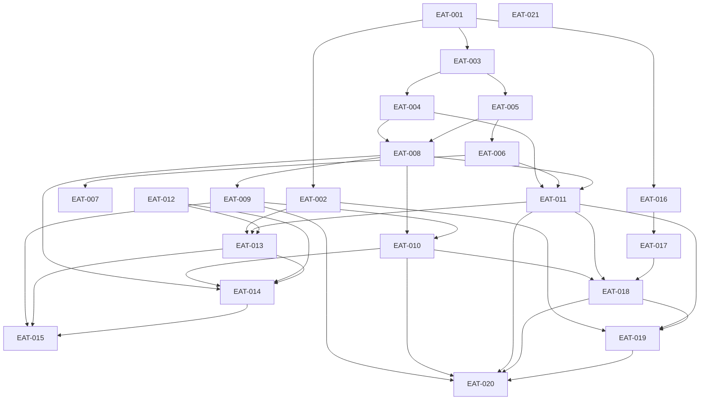

GENERATED — DO NOT EDIT DIRECTLY
Source: curriculum/courses/*/course.json; curriculum/courses/**/{module,unit,lesson}.json; catalog/skills/*.json; graph/knowledge-graph.json; sources/repositories.json
Regenerate: npm run build:reports

# Roadmap curricolare

Coverage della fonte ≠ mastery personale. C descrive il materiale SSRI; M è il requisito IronMath, non una competenza attribuita al learner. Stato del contenuto e assessment personale restano separati.

- samuelecorra/cybersec_unimi_ssri2.0: audit `7467a51576a7c1514edacb26d9408bf0c1444a7d` (6310 file); locale `c691750bf85e6130b9ef59eeb357366508d05311` (6271 file), drift `different-audit-unavailable`. Oggetto commit audit non disponibile localmente. README e inventario correnti letti; lezioni ora sotto lessons/cybersecurity/. Conteggi e coverage restano quelli forniti, non riverificati sullo snapshot. Il viewer React/Vite e il workflow correnti non sono coverage curricolare.
- samuelecorra/ironmath: audit `22da98929d9c70e20a5a3a9d6fabfe2bd0279431` (4069 file); locale `ec809fb3f4dd8e5b8493fddcb53ef759d5d9d047` (4069 file), drift `ahead`. Snapshot audit accessibile e antenato di HEAD; controllati manifest e architettura, senza nuovo audit integrale.

Conteggi generati: 21 corsi; 52 skill; 8 moduli attivi; 9 unità; 11 lezioni; 218 nodi; 490 archi (37 required).

| Ordine | Corso | Titolo | Fase | Priorità | Target | Stato | Required | Recommended |
| --- | --- | --- | --- | --- | --- | --- | --- | --- |
| 1 | [EAT-001](../curriculum/courses/EAT-001-workstation-cli-markdown/course.json) | Engineering workstation, CLI, Markdown and reproducibility | foundations | P0 | M3 | in_progress | — | — |
| 2 | [EAT-002](../curriculum/courses/EAT-002-git-multi-machine/course.json) | Git and GitHub for multi-machine collaboration | foundations | P0 | M4 | in_progress | EAT-001 | — |
| 3 | [EAT-003](../curriculum/courses/EAT-003-modern-javascript-browser/course.json) | Modern JavaScript and the browser runtime | foundations | P0 | M3 | planned | EAT-001 | — |
| 4 | [EAT-004](../curriculum/courses/EAT-004-node-npm-esm/course.json) | Node.js, npm, ESM and JavaScript toolchains | foundations | P0 | M3 | in_progress | EAT-003 | — |
| 5 | [EAT-005](../curriculum/courses/EAT-005-typescript-contracts/course.json) | TypeScript for contracts and refactoring | foundations | P0 | M3 | planned | EAT-003 | EAT-004 |
| 6 | [EAT-006](../curriculum/courses/EAT-006-react-vite/course.json) | React and Vite application engineering | application | P0 | M3 | planned | EAT-005 | — |
| 7 | [EAT-007](../curriculum/courses/EAT-007-frontend-systems/course.json) | Frontend systems: accessibility, design, performance and math UI | application | P1 | M3 | planned | EAT-006 | — |
| 8 | [EAT-008](../curriculum/courses/EAT-008-http-api-fastify/course.json) | HTTP, API design and Fastify backend engineering | application | P0 | M3 | planned | EAT-004, EAT-005 | — |
| 9 | [EAT-009](../curriculum/courses/EAT-009-postgres-prisma/course.json) | PostgreSQL and Prisma in production | application | P0 | M3 | planned | EAT-008 | — |
| 10 | [EAT-010](../curriculum/courses/EAT-010-security-privacy/course.json) | Authentication, tenancy, application security and privacy | application | P1 | M3 | planned | EAT-008, EAT-009 | — |
| 11 | [EAT-011](../curriculum/courses/EAT-011-quality-testing/course.json) | Quality engineering and automated testing | application | P0 | M4 | planned | EAT-004, EAT-006, EAT-008 | EAT-007, EAT-009, EAT-010 |
| 12 | [EAT-012](../curriculum/courses/EAT-012-docker-compose/course.json) | Docker, Compose and reproducible local stacks | operations | P1 | M3 | planned | — | EAT-004, EAT-008, EAT-009 |
| 13 | [EAT-013](../curriculum/courses/EAT-013-github-actions-supply-chain/course.json) | GitHub Actions, CI/CD and software supply chain | operations | P1 | M4 | planned | EAT-002, EAT-011, EAT-012 | EAT-010 |
| 14 | [EAT-014](../curriculum/courses/EAT-014-cloud-delivery/course.json) | Cloud delivery with Cloudflare and Railway | operations | P1 | M3 | planned | EAT-008, EAT-010, EAT-012, EAT-013 | — |
| 15 | [EAT-015](../curriculum/courses/EAT-015-observability-data-operations/course.json) | Observability, reliability and data operations | operations | P1 | M3 | planned | EAT-009, EAT-013, EAT-014 | EAT-011, EAT-012 |
| 16 | [EAT-016](../curriculum/courses/EAT-016-python-fastapi/course.json) | Production Python and FastAPI services | intelligence | P0 | M3 | in_progress | EAT-001 | — |
| 17 | [EAT-017](../curriculum/courses/EAT-017-llm-api/course.json) | LLM API and application engineering | intelligence | P1 | M3 | planned | EAT-016 | — |
| 18 | [EAT-018](../curriculum/courses/EAT-018-grounded-tutor-systems/course.json) | Grounded tutor systems: prompting, retrieval, safety and evaluations | intelligence | P1 | M4 | planned | EAT-010, EAT-011, EAT-017 | — |
| 19 | [EAT-019](../curriculum/courses/EAT-019-agentic-coding/course.json) | Agentic coding and repository-scale collaboration | intelligence | P1 | M4 | planned | EAT-002, EAT-011, EAT-018 | EAT-013 |
| 20 | [EAT-020](../curriculum/courses/EAT-020-architecture-curriculum-governance/course.json) | Software architecture, docs-as-code, curriculum and learning analytics governance | governance | P1 | M4 | planned | EAT-009, EAT-010, EAT-011, EAT-018, EAT-019 | EAT-002, EAT-007, EAT-013 |
| 21 | [EAT-021](../curriculum/courses/EAT-021-visual-studio-code/course.json) | Visual Studio Code: ambiente professionale e lavoro con agenti | foundations | P0 | M3 | in_progress | — | — |

## Gerarchia attiva

| Modulo | Unità | Lezione | Stato |
| --- | --- | --- | --- |
| EAT-001-M01 | [EAT-001-M01-U01](../curriculum/courses/EAT-001-workstation-cli-markdown/modules/EAT-001-M01-filesystem-processes-paths/units/EAT-001-M01-U01-fondamenti/unit.json) | [EAT-001-M01-U01-L01](../curriculum/courses/EAT-001-workstation-cli-markdown/modules/EAT-001-M01-filesystem-processes-paths/units/EAT-001-M01-U01-fondamenti/lessons/EAT-001-M01-U01-L01-filesystem-processes-paths/lesson.json) | draft |
| EAT-001-M02 | [EAT-001-M02-U01](../curriculum/courses/EAT-001-workstation-cli-markdown/modules/EAT-001-M02-safe-shell-environment/units/EAT-001-M02-U01-fondamenti/unit.json) | [EAT-001-M02-U01-L01](../curriculum/courses/EAT-001-workstation-cli-markdown/modules/EAT-001-M02-safe-shell-environment/units/EAT-001-M02-U01-fondamenti/lessons/EAT-001-M02-U01-L01-safe-shell-environment/lesson.json) | draft |
| EAT-001-M03 | [EAT-001-M03-U01](../curriculum/courses/EAT-001-workstation-cli-markdown/modules/EAT-001-M03-markdown-latex-docs/units/EAT-001-M03-U01-fondamenti/unit.json) | [EAT-001-M03-U01-L01](../curriculum/courses/EAT-001-workstation-cli-markdown/modules/EAT-001-M03-markdown-latex-docs/units/EAT-001-M03-U01-fondamenti/lessons/EAT-001-M03-U01-L01-markdown-latex-docs/lesson.json) | draft |
| EAT-002-M01 | [EAT-002-M01-U01](../curriculum/courses/EAT-002-git-multi-machine/modules/EAT-002-M01-git-state-model/units/EAT-002-M01-U01-fondamenti/unit.json) | [EAT-002-M01-U01-L01](../curriculum/courses/EAT-002-git-multi-machine/modules/EAT-002-M01-git-state-model/units/EAT-002-M01-U01-fondamenti/lessons/EAT-002-M01-U01-L01-git-state-model/lesson.json) | draft |
| EAT-002-M02 | [EAT-002-M02-U01](../curriculum/courses/EAT-002-git-multi-machine/modules/EAT-002-M02-two-machine-sync-and-recovery/units/EAT-002-M02-U01-fondamenti/unit.json) | [EAT-002-M02-U01-L01](../curriculum/courses/EAT-002-git-multi-machine/modules/EAT-002-M02-two-machine-sync-and-recovery/units/EAT-002-M02-U01-fondamenti/lessons/EAT-002-M02-U01-L01-two-machine-sync-and-recovery/lesson.json) | draft |
| EAT-004-M01 | [EAT-004-M01-U01](../curriculum/courses/EAT-004-node-npm-esm/modules/EAT-004-M01-node-npm-package-lock/units/EAT-004-M01-U01-fondamenti/unit.json) | [EAT-004-M01-U01-L01](../curriculum/courses/EAT-004-node-npm-esm/modules/EAT-004-M01-node-npm-package-lock/units/EAT-004-M01-U01-fondamenti/lessons/EAT-004-M01-U01-L01-node-npm-package-lock/lesson.json) | draft |
| EAT-016-M01 | [EAT-016-M01-U01](../curriculum/courses/EAT-016-python-fastapi/modules/EAT-016-M01-python-env-packaging/units/EAT-016-M01-U01-fondamenti/unit.json) | [EAT-016-M01-U01-L01](../curriculum/courses/EAT-016-python-fastapi/modules/EAT-016-M01-python-env-packaging/units/EAT-016-M01-U01-fondamenti/lessons/EAT-016-M01-U01-L01-python-env-packaging/lesson.json) | draft |
| EAT-021-M01 | [EAT-021-M01-U01](../curriculum/courses/EAT-021-visual-studio-code/modules/EAT-021-M01-workbench-e-controllo/units/EAT-021-M01-U01-orientamento/unit.json) | [EAT-021-M01-U01-L01](../curriculum/courses/EAT-021-visual-studio-code/modules/EAT-021-M01-workbench-e-controllo/units/EAT-021-M01-U01-orientamento/lessons/EAT-021-M01-U01-L01-interfaccia-workbench/lesson.json) | draft |
| EAT-021-M01 | [EAT-021-M01-U01](../curriculum/courses/EAT-021-visual-studio-code/modules/EAT-021-M01-workbench-e-controllo/units/EAT-021-M01-U01-orientamento/unit.json) | [EAT-021-M01-U01-L02](../curriculum/courses/EAT-021-visual-studio-code/modules/EAT-021-M01-workbench-e-controllo/units/EAT-021-M01-U01-orientamento/lessons/EAT-021-M01-U01-L02-workspace-e-file/lesson.json) | draft |
| EAT-021-M01 | [EAT-021-M01-U01](../curriculum/courses/EAT-021-visual-studio-code/modules/EAT-021-M01-workbench-e-controllo/units/EAT-021-M01-U01-orientamento/unit.json) | [EAT-021-M01-U01-L03](../curriculum/courses/EAT-021-visual-studio-code/modules/EAT-021-M01-workbench-e-controllo/units/EAT-021-M01-U01-orientamento/lessons/EAT-021-M01-U01-L03-settings-e-profili/lesson.json) | draft |
| EAT-021-M01 | [EAT-021-M01-U02](../curriculum/courses/EAT-021-visual-studio-code/modules/EAT-021-M01-workbench-e-controllo/units/EAT-021-M01-U02-lavorare-con-agenti/unit.json) | [EAT-021-M01-U02-L01](../curriculum/courses/EAT-021-visual-studio-code/modules/EAT-021-M01-workbench-e-controllo/units/EAT-021-M01-U02-lavorare-con-agenti/lessons/EAT-021-M01-U02-L01-prompt-contesto-verifica/lesson.json) | draft |

## DAG required

Solo gli archi required sono mostrati; recommended non bloccano il percorso. EAT-016 è un ramo parallelo dopo EAT-001; EAT-012 non ha required nel blueprint, ma i recommended aiutano a prepararlo.

## Moduli pianificati e attivi

### EAT-001

Riprodurre una sessione CLI e un documento verificabile su due sistemi.

| ID | Titolo | Outcome | Stato |
| --- | --- | --- | --- |
| EAT-001-M01 | Filesystem, processi, path e modello del terminale | Distinguere terminale, shell, comando e processo. Diagnosticare cwd, path, exit code e stream su una fixture read-only. Localizzare PID e porta del solo processo locale avviato per il lab. | draft |
| EAT-001-M02 | Shell sicura, environment e quoting | Correggere tre script innocui spiegando parsing, quoting ed environment. Tradurre i comandi essenziali fra Bash e PowerShell senza stampare secret. | draft |
| EAT-001-M03 | Markdown, LaTeX e documentazione verificabile | Correggere heading, link e delimitatori matematici in un documento minimo. Distinguere sorgente canonica, generated, historical e rendering. | draft |
| EAT-001-M04 | Setup riproducibile, version manager e diagnostica ambiente | Produrre e spiegare una prova delimitata di setup riproducibile, version manager e diagnostica ambiente, includendo un errore atteso e la sua diagnosi. | planned |

### EAT-002

Diagnosticare stato Git, sincronizzazione e recupero tra due macchine senza perdita.

| ID | Titolo | Outcome | Stato |
| --- | --- | --- | --- |
| EAT-002-M01 | Git: working tree, index, HEAD e snapshot | Predire status e diff a partire da working tree, index e commit. Creare un commit delimitato e verificare che contenga solo la versione staged. | draft |
| EAT-002-M02 | Git tra due macchine: sincronizzazione e recovery | Riconoscere fast-forward e divergenza da upstream e commit graph. Recuperare un conflitto tramite abort e continuazione senza perdere commit. Motivare rebase privato, merge condiviso, stash e recupero non distruttivo. | draft |
| EAT-002-M03 | Feature branch, merge e rebase | Produrre e spiegare una prova delimitata di feature branch, merge e rebase, includendo un errore atteso e la sua diagnosi. | planned |
| EAT-002-M04 | Conflitti, reflog, reset/revert e recovery | Produrre e spiegare una prova delimitata di conflitti, reflog, reset/revert e recovery, includendo un errore atteso e la sua diagnosi. | planned |
| EAT-002-M05 | Pull request, review, branch protection, tag e release | Produrre e spiegare una prova delimitata di pull request, review, branch protection, tag e release, includendo un errore atteso e la sua diagnosi. | planned |
| EAT-002-M06 | Bisect, worktree e manutenzione repository | Produrre e spiegare una prova delimitata di bisect, worktree e manutenzione repository, includendo un errore atteso e la sua diagnosi. | planned |

### EAT-003

Diagnosticare semantica JavaScript e flussi asincroni del browser con prove isolate.

| ID | Titolo | Outcome | Stato |
| --- | --- | --- | --- |
| EAT-003-M01 | Semantica JS | Produrre e spiegare una prova delimitata di semantica JS, includendo un errore atteso e la sua diagnosi. | planned |
| EAT-003-M02 | Funzioni/closure | Produrre e spiegare una prova delimitata di funzioni/closure, includendo un errore atteso e la sua diagnosi. | planned |
| EAT-003-M03 | Moduli | Produrre e spiegare una prova delimitata di moduli, includendo un errore atteso e la sua diagnosi. | planned |
| EAT-003-M04 | DOM/eventi | Produrre e spiegare una prova delimitata di DOM/eventi, includendo un errore atteso e la sua diagnosi. | planned |
| EAT-003-M05 | Event loop | Produrre e spiegare una prova delimitata di event loop, includendo un errore atteso e la sua diagnosi. | planned |
| EAT-003-M06 | Promise/async | Produrre e spiegare una prova delimitata di Promise/async, includendo un errore atteso e la sua diagnosi. | planned |
| EAT-003-M07 | Fetch/API | Produrre e spiegare una prova delimitata di Fetch/API, includendo un errore atteso e la sua diagnosi. | planned |
| EAT-003-M08 | Storage e browser security boundaries | Produrre e spiegare una prova delimitata di storage e browser security boundaries, includendo un errore atteso e la sua diagnosi. | planned |

### EAT-004

Spiegare e riprodurre runtime, installazione e build di package indipendenti.

| ID | Titolo | Outcome | Stato |
| --- | --- | --- | --- |
| EAT-004-M01 | Node runtime/process/fs/path, npm, package e lockfile | Eseguire un package ESM senza dipendenze e spiegare manifest e lockfile. Distinguere npm install da npm ci e motivare la riproducibilità senza upgrade ciechi. | draft |
| EAT-004-M02 | Npm e manifest | Produrre e spiegare una prova delimitata di npm e manifest, includendo un errore atteso e la sua diagnosi. | planned |
| EAT-004-M03 | Lockfile/semver/install strategy | Produrre e spiegare una prova delimitata di lockfile/semver/install strategy, includendo un errore atteso e la sua diagnosi. | planned |
| EAT-004-M04 | ESM e module resolution | Produrre e spiegare una prova delimitata di ESM e module resolution, includendo un errore atteso e la sua diagnosi. | planned |
| EAT-004-M05 | Script/tool CLI | Produrre e spiegare una prova delimitata di script/tool CLI, includendo un errore atteso e la sua diagnosi. | planned |
| EAT-004-M06 | Vite/Rollup e build-time env | Produrre e spiegare una prova delimitata di Vite/Rollup e build-time env, includendo un errore atteso e la sua diagnosi. | planned |

### EAT-005

Rifattorizzare contratti TypeScript e verificare i boundary runtime.

| ID | Titolo | Outcome | Stato |
| --- | --- | --- | --- |
| EAT-005-M01 | Tipi e inference | Produrre e spiegare una prova delimitata di tipi e inference, includendo un errore atteso e la sua diagnosi. | planned |
| EAT-005-M02 | Union/narrowing | Produrre e spiegare una prova delimitata di union/narrowing, includendo un errore atteso e la sua diagnosi. | planned |
| EAT-005-M03 | Object/function types | Produrre e spiegare una prova delimitata di object/function types, includendo un errore atteso e la sua diagnosi. | planned |
| EAT-005-M04 | Generics | Produrre e spiegare una prova delimitata di generics, includendo un errore atteso e la sua diagnosi. | planned |
| EAT-005-M05 | Moduli/d.ts | Produrre e spiegare una prova delimitata di moduli/d.ts, includendo un errore atteso e la sua diagnosi. | planned |
| EAT-005-M06 | `tsconfig` | Produrre e spiegare una prova delimitata di `tsconfig`, includendo un errore atteso e la sua diagnosi. | planned |
| EAT-005-M07 | Boundary runtime con Zod | Produrre e spiegare una prova delimitata di boundary runtime con Zod, includendo un errore atteso e la sua diagnosi. | planned |
| EAT-005-M08 | Refactoring sicuro | Produrre e spiegare una prova delimitata di refactoring sicuro, includendo un errore atteso e la sua diagnosi. | planned |

### EAT-006

Implementare un flusso React con stato, router e recupero dagli errori.

| ID | Titolo | Outcome | Stato |
| --- | --- | --- | --- |
| EAT-006-M01 | Componenti/JSX | Produrre e spiegare una prova delimitata di componenti/JSX, includendo un errore atteso e la sua diagnosi. | planned |
| EAT-006-M02 | Props/state | Produrre e spiegare una prova delimitata di props/state, includendo un errore atteso e la sua diagnosi. | planned |
| EAT-006-M03 | Hooks/effect | Produrre e spiegare una prova delimitata di hooks/effect, includendo un errore atteso e la sua diagnosi. | planned |
| EAT-006-M04 | Context | Produrre e spiegare una prova delimitata di context, includendo un errore atteso e la sua diagnosi. | planned |
| EAT-006-M05 | Router | Produrre e spiegare una prova delimitata di Router, includendo un errore atteso e la sua diagnosi. | planned |
| EAT-006-M06 | Async UI | Produrre e spiegare una prova delimitata di async UI, includendo un errore atteso e la sua diagnosi. | planned |
| EAT-006-M07 | Error boundary | Produrre e spiegare una prova delimitata di error boundary, includendo un errore atteso e la sua diagnosi. | planned |
| EAT-006-M08 | Persistence | Produrre e spiegare una prova delimitata di persistence, includendo un errore atteso e la sua diagnosi. | planned |
| EAT-006-M09 | Asset/alias/lazy loading Vite | Produrre e spiegare una prova delimitata di asset/alias/lazy loading Vite, includendo un errore atteso e la sua diagnosi. | planned |

### EAT-007

Verificare accessibilità, prestazioni e rendering matematico di una UI.

| ID | Titolo | Outcome | Stato |
| --- | --- | --- | --- |
| EAT-007-M01 | CSS architecture/token | Produrre e spiegare una prova delimitata di CSS architecture/token, includendo un errore atteso e la sua diagnosi. | planned |
| EAT-007-M02 | Responsive component | Produrre e spiegare una prova delimitata di responsive component, includendo un errore atteso e la sua diagnosi. | planned |
| EAT-007-M03 | WCAG/ARIA/tastiera | Produrre e spiegare una prova delimitata di WCAG/ARIA/tastiera, includendo un errore atteso e la sua diagnosi. | planned |
| EAT-007-M04 | Performance e bundle | Produrre e spiegare una prova delimitata di performance e bundle, includendo un errore atteso e la sua diagnosi. | planned |
| EAT-007-M05 | Immagini | Produrre e spiegare una prova delimitata di immagini, includendo un errore atteso e la sua diagnosi. | planned |
| EAT-007-M06 | Chart | Produrre e spiegare una prova delimitata di chart, includendo un errore atteso e la sua diagnosi. | planned |
| EAT-007-M07 | Markdown/KaTeX | Produrre e spiegare una prova delimitata di Markdown/KaTeX, includendo un errore atteso e la sua diagnosi. | planned |
| EAT-007-M08 | Math input | Produrre e spiegare una prova delimitata di math input, includendo un errore atteso e la sua diagnosi. | planned |
| EAT-007-M09 | Canvas/numerical UI come elective | Produrre e spiegare una prova delimitata di Canvas/numerical UI come elective, includendo un errore atteso e la sua diagnosi. | planned |

### EAT-008

Progettare un contratto API Fastify con validation, errori e streaming cancellabile.

| ID | Titolo | Outcome | Stato |
| --- | --- | --- | --- |
| EAT-008-M01 | Semantica HTTP | Produrre e spiegare una prova delimitata di semantica HTTP, includendo un errore atteso e la sua diagnosi. | planned |
| EAT-008-M02 | Resource/API design | Produrre e spiegare una prova delimitata di resource/API design, includendo un errore atteso e la sua diagnosi. | planned |
| EAT-008-M03 | Fastify lifecycle/plugin | Produrre e spiegare una prova delimitata di Fastify lifecycle/plugin, includendo un errore atteso e la sua diagnosi. | planned |
| EAT-008-M04 | Validation/error contract | Produrre e spiegare una prova delimitata di validation/error contract, includendo un errore atteso e la sua diagnosi. | planned |
| EAT-008-M05 | Idempotency/rate limit | Produrre e spiegare una prova delimitata di idempotency/rate limit, includendo un errore atteso e la sua diagnosi. | planned |
| EAT-008-M06 | REST auth boundary | Produrre e spiegare una prova delimitata di REST auth boundary, includendo un errore atteso e la sua diagnosi. | planned |
| EAT-008-M07 | SSE | Produrre e spiegare una prova delimitata di SSE, includendo un errore atteso e la sua diagnosi. | planned |
| EAT-008-M08 | Proxy e cancellation | Produrre e spiegare una prova delimitata di proxy e cancellation, includendo un errore atteso e la sua diagnosi. | planned |

### EAT-009

Progettare e provare una migrazione Prisma con controllo transazioni e recovery.

| ID | Titolo | Outcome | Stato |
| --- | --- | --- | --- |
| EAT-009-M01 | Postgres operativo | Produrre e spiegare una prova delimitata di Postgres operativo, includendo un errore atteso e la sua diagnosi. | planned |
| EAT-009-M02 | Prisma schema/client | Produrre e spiegare una prova delimitata di Prisma schema/client, includendo un errore atteso e la sua diagnosi. | planned |
| EAT-009-M03 | Migrazioni | Produrre e spiegare una prova delimitata di migrazioni, includendo un errore atteso e la sua diagnosi. | planned |
| EAT-009-M04 | Seed | Produrre e spiegare una prova delimitata di seed, includendo un errore atteso e la sua diagnosi. | planned |
| EAT-009-M05 | Transazioni | Produrre e spiegare una prova delimitata di transazioni, includendo un errore atteso e la sua diagnosi. | planned |
| EAT-009-M06 | Index/constraint/query plan | Produrre e spiegare una prova delimitata di index/constraint/query plan, includendo un errore atteso e la sua diagnosi. | planned |
| EAT-009-M07 | Pool | Produrre e spiegare una prova delimitata di pool, includendo un errore atteso e la sua diagnosi. | planned |
| EAT-009-M08 | Backfill | Produrre e spiegare una prova delimitata di backfill, includendo un errore atteso e la sua diagnosi. | planned |
| EAT-009-M09 | Retention | Produrre e spiegare una prova delimitata di retention, includendo un errore atteso e la sua diagnosi. | planned |
| EAT-009-M10 | Backup/restore | Produrre e spiegare una prova delimitata di backup/restore, includendo un errore atteso e la sua diagnosi. | planned |

### EAT-010

Verificare auth, isolamento tenant e ciclo dei dati con test negativi.

| ID | Titolo | Outcome | Stato |
| --- | --- | --- | --- |
| EAT-010-M01 | Threat model/secret | Produrre e spiegare una prova delimitata di threat model/secret, includendo un errore atteso e la sua diagnosi. | planned |
| EAT-010-M02 | Password/JWT/cookie | Produrre e spiegare una prova delimitata di password/JWT/cookie, includendo un errore atteso e la sua diagnosi. | planned |
| EAT-010-M03 | Refresh rotation | Produrre e spiegare una prova delimitata di refresh rotation, includendo un errore atteso e la sua diagnosi. | planned |
| EAT-010-M04 | CORS/CSRF/CSP | Produrre e spiegare una prova delimitata di CORS/CSRF/CSP, includendo un errore atteso e la sua diagnosi. | planned |
| EAT-010-M05 | Tenant e IDOR | Produrre e spiegare una prova delimitata di tenant e IDOR, includendo un errore atteso e la sua diagnosi. | planned |
| EAT-010-M06 | Field encryption | Produrre e spiegare una prova delimitata di field encryption, includendo un errore atteso e la sua diagnosi. | planned |
| EAT-010-M07 | Minimizzazione | Produrre e spiegare una prova delimitata di minimizzazione, includendo un errore atteso e la sua diagnosi. | planned |
| EAT-010-M08 | DSAR/delete | Produrre e spiegare una prova delimitata di DSAR/delete, includendo un errore atteso e la sua diagnosi. | planned |
| EAT-010-M09 | Dati dei minori | Produrre e spiegare una prova delimitata di dati dei minori, includendo un errore atteso e la sua diagnosi. | planned |

### EAT-011

Scegliere e implementare prove cross-layer che rilevino regressioni reali.

| ID | Titolo | Outcome | Stato |
| --- | --- | --- | --- |
| EAT-011-M01 | Strategia e piramide | Produrre e spiegare una prova delimitata di strategia e piramide, includendo un errore atteso e la sua diagnosi. | planned |
| EAT-011-M02 | `node:test` | Produrre e spiegare una prova delimitata di `node:test`, includendo un errore atteso e la sua diagnosi. | planned |
| EAT-011-M03 | Pytest | Produrre e spiegare una prova delimitata di pytest, includendo un errore atteso e la sua diagnosi. | planned |
| EAT-011-M04 | Playwright | Produrre e spiegare una prova delimitata di Playwright, includendo un errore atteso e la sua diagnosi. | planned |
| EAT-011-M05 | Axe/a11y | Produrre e spiegare una prova delimitata di axe/a11y, includendo un errore atteso e la sua diagnosi. | planned |
| EAT-011-M06 | Unit/contract/integration/E2E | Produrre e spiegare una prova delimitata di unit/contract/integration/E2E, includendo un errore atteso e la sua diagnosi. | planned |
| EAT-011-M07 | DB effimero | Produrre e spiegare una prova delimitata di DB effimero, includendo un errore atteso e la sua diagnosi. | planned |
| EAT-011-M08 | Fixture/mock | Produrre e spiegare una prova delimitata di fixture/mock, includendo un errore atteso e la sua diagnosi. | planned |
| EAT-011-M09 | Regression | Produrre e spiegare una prova delimitata di regression, includendo un errore atteso e la sua diagnosi. | planned |
| EAT-011-M10 | Test inventory e anti-no-op | Produrre e spiegare una prova delimitata di test inventory e anti-no-op, includendo un errore atteso e la sua diagnosi. | planned |

### EAT-012

Riprodurre e diagnosticare uno stack locale containerizzato con cleanup selettivo.

| ID | Titolo | Outcome | Stato |
| --- | --- | --- | --- |
| EAT-012-M01 | Image/container/layer | Produrre e spiegare una prova delimitata di image/container/layer, includendo un errore atteso e la sua diagnosi. | planned |
| EAT-012-M02 | Dockerfile multi-stage | Produrre e spiegare una prova delimitata di Dockerfile multi-stage, includendo un errore atteso e la sua diagnosi. | planned |
| EAT-012-M03 | Rete/volume | Produrre e spiegare una prova delimitata di rete/volume, includendo un errore atteso e la sua diagnosi. | planned |
| EAT-012-M04 | Compose | Produrre e spiegare una prova delimitata di Compose, includendo un errore atteso e la sua diagnosi. | planned |
| EAT-012-M05 | Health/dependency | Produrre e spiegare una prova delimitata di health/dependency, includendo un errore atteso e la sua diagnosi. | planned |
| EAT-012-M06 | Debug/log | Produrre e spiegare una prova delimitata di debug/log, includendo un errore atteso e la sua diagnosi. | planned |
| EAT-012-M07 | Cleanup sicuro | Produrre e spiegare una prova delimitata di cleanup sicuro, includendo un errore atteso e la sua diagnosi. | planned |
| EAT-012-M08 | Parità locale/CI | Produrre e spiegare una prova delimitata di parità locale/CI, includendo un errore atteso e la sua diagnosi. | planned |

### EAT-013

Revieware una pipeline CI con permessi minimi, supply chain e release gate.

| ID | Titolo | Outcome | Stato |
| --- | --- | --- | --- |
| EAT-013-M01 | Event/job/step | Produrre e spiegare una prova delimitata di event/job/step, includendo un errore atteso e la sua diagnosi. | planned |
| EAT-013-M02 | Cache/service container/artifact | Produrre e spiegare una prova delimitata di cache/service container/artifact, includendo un errore atteso e la sua diagnosi. | planned |
| EAT-013-M03 | Permission e secret | Produrre e spiegare una prova delimitata di permission e secret, includendo un errore atteso e la sua diagnosi. | planned |
| EAT-013-M04 | Pinning | Produrre e spiegare una prova delimitata di pinning, includendo un errore atteso e la sua diagnosi. | planned |
| EAT-013-M05 | Dependency audit | Produrre e spiegare una prova delimitata di dependency audit, includendo un errore atteso e la sua diagnosi. | planned |
| EAT-013-M06 | Secret scan | Produrre e spiegare una prova delimitata di secret scan, includendo un errore atteso e la sua diagnosi. | planned |
| EAT-013-M07 | Concurrency | Produrre e spiegare una prova delimitata di concurrency, includendo un errore atteso e la sua diagnosi. | planned |
| EAT-013-M08 | Required check | Produrre e spiegare una prova delimitata di required check, includendo un errore atteso e la sua diagnosi. | planned |
| EAT-013-M09 | Deploy gate e release | Produrre e spiegare una prova delimitata di deploy gate e release, includendo un errore atteso e la sua diagnosi. | planned |

### EAT-014

Descrivere una consegna cloud con ambienti, smoke e rollback verificabili.

| ID | Titolo | Outcome | Stato |
| --- | --- | --- | --- |
| EAT-014-M01 | Confini cloud | Produrre e spiegare una prova delimitata di confini cloud, includendo un errore atteso e la sua diagnosi. | planned |
| EAT-014-M02 | Pages/Worker/Access | Produrre e spiegare una prova delimitata di Pages/Worker/Access, includendo un errore atteso e la sua diagnosi. | planned |
| EAT-014-M03 | Railway service | Produrre e spiegare una prova delimitata di Railway service, includendo un errore atteso e la sua diagnosi. | planned |
| EAT-014-M04 | DNS/TLS | Produrre e spiegare una prova delimitata di DNS/TLS, includendo un errore atteso e la sua diagnosi. | planned |
| EAT-014-M05 | Env/staging/prod | Produrre e spiegare una prova delimitata di env/staging/prod, includendo un errore atteso e la sua diagnosi. | planned |
| EAT-014-M06 | CORS/CSP | Produrre e spiegare una prova delimitata di CORS/CSP, includendo un errore atteso e la sua diagnosi. | planned |
| EAT-014-M07 | Migration pre-deploy | Produrre e spiegare una prova delimitata di migration pre-deploy, includendo un errore atteso e la sua diagnosi. | planned |
| EAT-014-M08 | Smoke | Produrre e spiegare una prova delimitata di smoke, includendo un errore atteso e la sua diagnosi. | planned |
| EAT-014-M09 | Rollback | Produrre e spiegare una prova delimitata di rollback, includendo un errore atteso e la sua diagnosi. | planned |

### EAT-015

Diagnosticare un incidente sintetico e dimostrare un restore con metriche sanitizzate.

| ID | Titolo | Outcome | Stato |
| --- | --- | --- | --- |
| EAT-015-M01 | Structured log | Produrre e spiegare una prova delimitata di structured log, includendo un errore atteso e la sua diagnosi. | planned |
| EAT-015-M02 | Metric/health | Produrre e spiegare una prova delimitata di metric/health, includendo un errore atteso e la sua diagnosi. | planned |
| EAT-015-M03 | SLI/SLO | Produrre e spiegare una prova delimitata di SLI/SLO, includendo un errore atteso e la sua diagnosi. | planned |
| EAT-015-M04 | Alert sanitizzato | Produrre e spiegare una prova delimitata di alert sanitizzato, includendo un errore atteso e la sua diagnosi. | planned |
| EAT-015-M05 | Data freshness/quality | Produrre e spiegare una prova delimitata di data freshness/quality, includendo un errore atteso e la sua diagnosi. | planned |
| EAT-015-M06 | Incident/runbook | Produrre e spiegare una prova delimitata di incident/runbook, includendo un errore atteso e la sua diagnosi. | planned |
| EAT-015-M07 | Retention purge | Produrre e spiegare una prova delimitata di retention purge, includendo un errore atteso e la sua diagnosi. | planned |
| EAT-015-M08 | Backup/restore drill | Produrre e spiegare una prova delimitata di backup/restore drill, includendo un errore atteso e la sua diagnosi. | planned |
| EAT-015-M09 | Capacity e pool | Produrre e spiegare una prova delimitata di capacity e pool, includendo un errore atteso e la sua diagnosi. | planned |

### EAT-016

Leggere e testare un servizio Python con package src e ambiente isolato.

| ID | Titolo | Outcome | Stato |
| --- | --- | --- | --- |
| EAT-016-M01 | Python: ambiente, package src e test standard-library; richiamo al core | Creare un venv locale e identificare interprete e import path. Eseguire un package src e un test standard-library senza installazioni di rete. Spiegare requirements, pyproject ed editable install distinguendoli dal test diretto. | draft |
| EAT-016-M02 | Venv/pip | Produrre e spiegare una prova delimitata di venv/pip, includendo un errore atteso e la sua diagnosi. | planned |
| EAT-016-M03 | Requirements/pyproject | Produrre e spiegare una prova delimitata di requirements/pyproject, includendo un errore atteso e la sua diagnosi. | planned |
| EAT-016-M04 | Package `src` | Produrre e spiegare una prova delimitata di package `src`, includendo un errore atteso e la sua diagnosi. | planned |
| EAT-016-M05 | Typing/error | Produrre e spiegare una prova delimitata di typing/error, includendo un errore atteso e la sua diagnosi. | planned |
| EAT-016-M06 | Pytest | Produrre e spiegare una prova delimitata di pytest, includendo un errore atteso e la sua diagnosi. | planned |
| EAT-016-M07 | Async I/O | Produrre e spiegare una prova delimitata di async I/O, includendo un errore atteso e la sua diagnosi. | planned |
| EAT-016-M08 | FastAPI/Uvicorn | Produrre e spiegare una prova delimitata di FastAPI/Uvicorn, includendo un errore atteso e la sua diagnosi. | planned |
| EAT-016-M09 | Config e packaging | Produrre e spiegare una prova delimitata di config e packaging, includendo un errore atteso e la sua diagnosi. | planned |

### EAT-017

Progettare un client LLM con streaming, budget ed error recovery osservabile.

| ID | Titolo | Outcome | Stato |
| --- | --- | --- | --- |
| EAT-017-M01 | Terminologia/tokens/context | Produrre e spiegare una prova delimitata di terminologia/tokens/context, includendo un errore atteso e la sua diagnosi. | planned |
| EAT-017-M02 | Model selection | Produrre e spiegare una prova delimitata di model selection, includendo un errore atteso e la sua diagnosi. | planned |
| EAT-017-M03 | API/streaming | Produrre e spiegare una prova delimitata di API/streaming, includendo un errore atteso e la sua diagnosi. | planned |
| EAT-017-M04 | Structured output/tool use | Produrre e spiegare una prova delimitata di structured output/tool use, includendo un errore atteso e la sua diagnosi. | planned |
| EAT-017-M05 | Cost/latency | Produrre e spiegare una prova delimitata di cost/latency, includendo un errore atteso e la sua diagnosi. | planned |
| EAT-017-M06 | Provider error/retry | Produrre e spiegare una prova delimitata di provider error/retry, includendo un errore atteso e la sua diagnosi. | planned |
| EAT-017-M07 | Privacy e data control | Produrre e spiegare una prova delimitata di privacy e data control, includendo un errore atteso e la sua diagnosi. | planned |

### EAT-018

Valutare un tutor grounded con contratti prompt, safety ed eval ripetibili.

| ID | Titolo | Outcome | Stato |
| --- | --- | --- | --- |
| EAT-018-M01 | Prompt contract | Produrre e spiegare una prova delimitata di prompt contract, includendo un errore atteso e la sua diagnosi. | planned |
| EAT-018-M02 | Context/retrieval/grounding | Produrre e spiegare una prova delimitata di context/retrieval/grounding, includendo un errore atteso e la sua diagnosi. | planned |
| EAT-018-M03 | Routing | Produrre e spiegare una prova delimitata di routing, includendo un errore atteso e la sua diagnosi. | planned |
| EAT-018-M04 | Conversation state | Produrre e spiegare una prova delimitata di conversation state, includendo un errore atteso e la sua diagnosi. | planned |
| EAT-018-M05 | Tutoring socratico | Produrre e spiegare una prova delimitata di tutoring socratico, includendo un errore atteso e la sua diagnosi. | planned |
| EAT-018-M06 | Pre-routing safety | Produrre e spiegare una prova delimitata di pre-routing safety, includendo un errore atteso e la sua diagnosi. | planned |
| EAT-018-M07 | Post-processing | Produrre e spiegare una prova delimitata di post-processing, includendo un errore atteso e la sua diagnosi. | planned |
| EAT-018-M08 | Golden eval | Produrre e spiegare una prova delimitata di golden eval, includendo un errore atteso e la sua diagnosi. | planned |
| EAT-018-M09 | Red-team | Produrre e spiegare una prova delimitata di red-team, includendo un errore atteso e la sua diagnosi. | planned |
| EAT-018-M10 | Observability | Produrre e spiegare una prova delimitata di observability, includendo un errore atteso e la sua diagnosi. | planned |

### EAT-019

Condurre un task con agente controllando contesto, permessi, diff e apprendimento autonomo.

| ID | Titolo | Outcome | Stato |
| --- | --- | --- | --- |
| EAT-019-M01 | Instruction files/context | Produrre e spiegare una prova delimitata di instruction files/context, includendo un errore atteso e la sua diagnosi. | planned |
| EAT-019-M02 | Permission/tool boundary | Produrre e spiegare una prova delimitata di permission/tool boundary, includendo un errore atteso e la sua diagnosi. | planned |
| EAT-019-M03 | Task decomposition | Produrre e spiegare una prova delimitata di task decomposition, includendo un errore atteso e la sua diagnosi. | planned |
| EAT-019-M04 | Diff/test loop | Produrre e spiegare una prova delimitata di diff/test loop, includendo un errore atteso e la sua diagnosi. | planned |
| EAT-019-M05 | Handoff | Produrre e spiegare una prova delimitata di handoff, includendo un errore atteso e la sua diagnosi. | planned |
| EAT-019-M06 | Worktree | Produrre e spiegare una prova delimitata di worktree, includendo un errore atteso e la sua diagnosi. | planned |
| EAT-019-M07 | Multi-agent boundary | Produrre e spiegare una prova delimitata di multi-agent boundary, includendo un errore atteso e la sua diagnosi. | planned |
| EAT-019-M08 | Secret discipline | Produrre e spiegare una prova delimitata di secret discipline, includendo un errore atteso e la sua diagnosi. | planned |
| EAT-019-M09 | Apprendimento senza dipendenza dall’agente | Produrre e spiegare una prova delimitata di apprendimento senza dipendenza dall’agente, includendo un errore atteso e la sua diagnosi. | planned |

### EAT-020

Revieware confini architetturali e provenance curricolare con schema, grafo e ADR.

| ID | Titolo | Outcome | Stato |
| --- | --- | --- | --- |
| EAT-020-M01 | Monorepo boundary | Produrre e spiegare una prova delimitata di monorepo boundary, includendo un errore atteso e la sua diagnosi. | planned |
| EAT-020-M02 | Architecture map/ADR | Produrre e spiegare una prova delimitata di architecture map/ADR, includendo un errore atteso e la sua diagnosi. | planned |
| EAT-020-M03 | Import graph/dead code | Produrre e spiegare una prova delimitata di import graph/dead code, includendo un errore atteso e la sua diagnosi. | planned |
| EAT-020-M04 | Docs-as-code | Produrre e spiegare una prova delimitata di docs-as-code, includendo un errore atteso e la sua diagnosi. | planned |
| EAT-020-M05 | Canonical source | Produrre e spiegare una prova delimitata di canonical source, includendo un errore atteso e la sua diagnosi. | planned |
| EAT-020-M06 | Curriculum schema | Produrre e spiegare una prova delimitata di curriculum schema, includendo un errore atteso e la sua diagnosi. | planned |
| EAT-020-M07 | Knowledge graph | Produrre e spiegare una prova delimitata di knowledge graph, includendo un errore atteso e la sua diagnosi. | planned |
| EAT-020-M08 | Provenance/calibration | Produrre e spiegare una prova delimitata di provenance/calibration, includendo un errore atteso e la sua diagnosi. | planned |
| EAT-020-M09 | Lifecycle/deprecation | Produrre e spiegare una prova delimitata di lifecycle/deprecation, includendo un errore atteso e la sua diagnosi. | planned |
| EAT-020-M10 | GDPR/AI governance | Produrre e spiegare una prova delimitata di GDPR/AI governance, includendo un errore atteso e la sua diagnosi. | planned |

### EAT-021

Controllare editor, workspace, impostazioni e strumenti senza confondere interfaccia, repository e ambiente di esecuzione. Usare Copilot, Codex e Claude Code con contesto delimitato, revisione dei cambiamenti e verifiche osservabili. Programma in 12 moduli: soltanto il primo è avviato; la guida personale alle estensioni attende l’export.

| ID | Titolo | Outcome | Stato |
| --- | --- | --- | --- |
| EAT-021-M01 | Workbench e controllo del progetto | Riconoscere le aree della GUI, aprire il workspace corretto, diagnosticare le impostazioni e formulare una richiesta verificabile a un agente. | draft |
| EAT-021-M02 | Editing, ricerca e navigazione del codice | Unità: editing e cursori; ricerca con include/exclude e regex; simboli, riferimenti e refactoring. Una lezione per comando o modello mentale, con esercizi su codice locale. | planned |
| EAT-021-M03 | Impostazioni, profili e sincronizzazione | Unità: precedenza User/Remote/Workspace/linguaggio; settings di editor e file; terminale, Git, debug e AI; JSONC e policy; profili, export e Sync. Inventario delle impostazioni applicabili alla versione dichiarata, con effetto, trade-off e ripristino. | planned |
| EAT-021-M04 | Estensioni del profilo personale | Unità: leggere publisher, ID e versione; funzione e attivazione; configurazione; conflitti, prestazioni e bisect. Scheda per ogni estensione soltanto dopo ricezione e verifica dell’export del profilo principale. | planned |
| EAT-021-M05 | Terminale, task e toolchain riproducibile | Unità: shell, cwd e processi; script npm e task; runtime Node/Python; output, exit code e problem matcher. Riprodurre un comando e diagnosticare un errore senza cambiare ambiente alla cieca. | planned |
| EAT-021-M06 | Debugging, test e diagnostica | Unità: breakpoint, stack e variabili; configurazioni launch/attach; Test Explorer; debug Node e Python; browser, performance e log. Isolare la causa di un difetto mediante una prova ripetibile. | planned |
| EAT-021-M07 | Git e GitHub dalla GUI | Unità: diff e staging; branch, stash e worktree; conflitti; PR e review. Collegare ogni azione grafica al modello Git di EAT-002, evitando duplicazione del corso completo Git/GitHub. | planned |
| EAT-021-M08 | Copilot: account, pannello e agenti | Unità: accesso e piani da verificare nelle fonti correnti; completamenti e chat; contesto, modello, harness, ruolo e permessi; review e ripristino; istruzioni e consumo. Distinguere funzioni documentate, disponibili nel proprio piano e realmente osservate. | planned |
| EAT-021-M09 | Codex in VS Code | Unità: estensione, CLI e app; sessione e contesto; prompt e istruzioni; permessi e strumenti; diff e verifiche; interruzione e handoff. Ogni guida della GUI dichiara versione, piattaforma e data delle fonti OpenAI. | planned |
| EAT-021-M10 | Claude Code in VS Code | Unità: pannello ed estensione; riferimenti ai file; modalità e piani; modello e comandi; review e checkpoint; rapporto con CLI, CLAUDE.md e strumenti. Verificare menu e prerequisiti sulla versione effettiva. | planned |
| EAT-021-M11 | Sviluppo remoto e ambienti isolati | Unità: SSH e WSL; Dev Containers; estensioni locali/remote; porte e debugging; Codespaces e costi. Laboratori remoti separati e autorizzati, dopo Docker; nessuna modifica a infrastrutture reali durante la lettura. | planned |
| EAT-021-M12 | Laboratorio finale: orientarsi in IronMath | Unità: confini del monorepo; leggere package e workflow; seguire un errore dalla GUI alla CI; proporre una modifica piccola, rivedere il diff e documentare la prova. Caso reale fissato a commit, senza eseguire deploy o usare dati reali. | planned |
