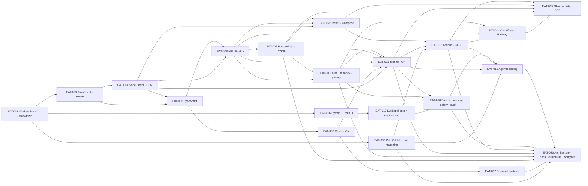

# Engineering Atlas — audit, gap analysis, knowledge graph e blueprint

**Data dell’audit:** 5 settembre 2026  
**Obiettivo:** derivare un curriculum locale, separato da IronMath, che colmi il divario tra ciò che è effettivamente documentato nella repository universitaria e ciò che serve per comprendere, modificare, testare e operare IronMath end-to-end.  
**Destinazione prevista:** `~/Developer/engineering-atlas`  
**Vincolo:** nessuna GitHub Pages, nessuna pubblicazione e nessuna fusione con IronMath.

## 1. Esito in breve

La formula `IronMath required knowledge − SSRI covered knowledge` non produce un elenco di tecnologie isolate. Produce soprattutto un insieme di **ponti operativi**:

1. dai fondamenti di programmazione C/Java e JavaScript di base a TypeScript, Node, React e Fastify;
2. dalla teoria di basi di dati a PostgreSQL/Prisma, migrazioni, seed, pool, backfill e restore;
3. dalla teoria di Git, testing e DevOps alla manutenzione quotidiana con branch, rebase, pull request, CI, Docker, Cloudflare e Railway;
4. dalla sicurezza accademica all’implementazione di auth, tenancy, IDOR guard, cifratura applicativa, privacy dei minori e gestione dei secret;
5. da due file Python introduttivi a un servizio FastAPI impacchettato, asincrono, testato e distribuito;
6. da nessuna copertura curricolare LLM a prompt contracts, retrieval, routing, stato conversazionale, safety pre-routing, eval e osservabilità;
7. dall’uso occasionale di agenti alla capacità di governare agentic coding, istruzioni locali, permessi, contesto, verifiche e review dei diff;
8. dall’uso massiccio ma implicito di Markdown/LaTeX/JSON alla gestione intenzionale di documentazione e curriculum come codice.

La repository SSRI costituisce una base accademica ampia e utile. Non va rifatta. Engineering Atlas deve insegnare **come trasformare quella base in capacità di manutenzione autonoma**, senza presumere che la presenza di una tecnologia nel repository equivalga al suo insegnamento.

## 2. Perimetro e metodo

### 2.1 Snapshot verificati

| Repository | Branch | Commit verificato | File tracciati | Dimensione dei file tracciati |
|---|---:|---:|---:|---:|
| `samuelecorra/cybersec_unimi_ssri2.0` | `main` | `7467a51576a7c1514edacb26d9408bf0c1444a7d` | 6.310 | ~1,25 GB |
| `samuelecorra/ironmath` | `mvp-final` | `22da98929d9c70e20a5a3a9d6fabfe2bd0279431` | 4.069 | ~85,7 MB |

Gli hash sono stati confrontati con i branch remoti. IronMath è avanzato durante l’audit; la copia di analisi è stata aggiornata in fast-forward prima di fissare il risultato.

### 2.2 Che cosa significa “scansione completa” in questo rapporto

La scansione ha:

- inventariato tutti i file tracciati per path, estensione, dimensione e area;
- analizzato la struttura di ogni corso, modulo e unità della repository SSRI;
- distinto Markdown non vuoti, placeholder vuoti, sorgenti, configurazioni e asset binari;
- cercato in tutto il corpus testuale evidenze positive e negative delle tecnologie necessarie a IronMath;
- letto manualmente i documenti canonici, i manifest, i workflow, i contratti e le mappe architetturali di IronMath;
- confrontato manifest e lockfile, codice applicativo, test, schema Prisma, Docker, CI/CD, documentazione, servizio Python/LLM e package curriculum;
- usato roadmap.sh esclusivamente come tassonomia di nomi e percorsi, non come fonte da ripubblicare.

I 3.398 asset classificati come binari nella repository SSRI — soprattutto immagini, PDF e archivi — sono stati inventariati e ricondotti ai relativi corsi. Non è stato eseguito un nuovo OCR visuale di centinaia di PDF/immagini quando la stessa materia era già rappresentata dalle lezioni Markdown non vuote. Questa è un’analisi di copertura della repository, non una nuova certificazione filologica di ogni slide originale.

Il manifest [engineering-atlas-source-inventory.csv](./engineering-atlas-source-inventory.csv) registra path, commit, byte, categoria e livello di review per tutti i 10.379 file tracciati dei due snapshot.

### 2.3 Regola di evidenza

Una tecnologia presente nel codice che visualizza le lezioni **non è automaticamente una competenza insegnata**. Il rapporto usa due colonne concettuali separate:

- **copertura curricolare:** lezioni, laboratori, esercizi o materiali didattici non vuoti;
- **esposizione incidentale:** tecnologia usata dalla repository come prodotto o tooling, senza percorso didattico sufficiente.

Esempio: la repository SSRI usa React e Vite per il viewer, ma il curriculum non contiene un corso React operativo. Quindi React è “presente incidentalmente”, non “coperto”.

### 2.4 Scale

Copertura della fonte:

| Livello | Significato |
|---|---|
| `C0` | nessuna evidenza curricolare |
| `C1` | citazione o panoramica concettuale |
| `C2` | spiegazione con esempi o esercizi guidati |
| `C3` | laboratorio o implementazione sostanziale |
| `C4` | pratica validata in un sistema autentico mantenuto |

Mastery del curriculum futuro:

| Livello | Criterio osservabile |
|---|---|
| `M0 — Recognize` | riconosce il termine e sa localizzarlo |
| `M1 — Explain` | lo spiega, ne distingue scopo e failure mode |
| `M2 — Apply with guidance` | completa un task delimitato con checklist o esempi |
| `M3 — Work independently` | implementa, testa, diagnostica e recupera autonomamente |
| `M4 — Maintain and design` | cambia sistemi non familiari, progetta migrazioni e reviewa altri |

La copertura della repository non misura automaticamente la mastery personale dello studente. Engineering Atlas dovrà registrare separatamente **evidenza della fonte** e **prova individuale superata**.

## 3. Inventario delle repository

### 3.1 SSRI

La repository contiene 6.310 file tracciati: 2.912 testuali e 3.398 binari, per circa 554.000 righe testuali conteggiabili. Le estensioni più frequenti sono immagini PNG, Markdown, PDF, Java, C, JavaScript, HTML e CSS. Sotto `lessons/cybersecurity` sono presenti tutti e tre gli anni, più due embrioni extra per Python e PowerShell.

| Corso/area | File | Markdown | Markdown non vuoti | Evidenza dominante |
|---|---:|---:|---:|---|
| Analisi 1 | 274 | 217 | 217 | teoria ed esercizi completi |
| Architettura degli elaboratori | 66 | 44 | 44 | teoria + PDF + materiale LC-2 |
| Matematica discreta | 56 | 56 | 56 | algebra, geometria e spazi vettoriali |
| Programmazione | 389 | 37 | 37 | 139 C/H, 292 Java e tracce |
| Diritto penale informatico | 7 | 0 | 0 | soli PDF |
| Programmazione Web/Mobile | 777 | 455 | 272 | HTML/CSS forti; JS moderno incompleto |
| Aspetti organizzativi/gestionali cyber | 380 | 63 | 63 | rischio, organizzazione e sicurezza |
| Algoritmi e strutture dati | 445 | 102 | 102 | teoria, esercizi e prove |
| Sistemi operativi 1 | 114 | 50 | 50 | processi, processore, concorrenza |
| Sistemi operativi 2 | 202 | 66 | 66 | memoria, I/O, filesystem, distribuiti |
| Basi di dati | 416 | 141 | 141 | relazionale, SQL, transazioni, distribuiti |
| Reti di calcolatori | 637 | 151 | 151 | TCP/IP, applicativi, programmazione distribuita |
| Crittografia | 597 | 237 | 237 | classica, simmetrica, asimmetrica, hash, firme |
| Statistica e analisi dati | 231 | 76 | 76 | probabilità, variabili e argomenti avanzati |
| Computer forensics | 218 | 27 | 27 | processo forense e ambiti applicativi |
| Sicurezza sistemi e reti | 326 | 103 | 103 | attacchi, firewall, IDS, laboratori |
| Etica/legale/sociale/economia | 66 | 34 | 34 | impatti e governance |
| Gestione sicurezza sistemi informativi | 32 | 31 | 31 | gestione e controlli |
| PSS aggiornato | 300 | 18 | 18 | requisiti, modelli, testing, Git/DevOps |
| Progettazione software sicuro storica | 95 | 41 | 40 | teoria, Java, laboratorio |
| Sistemi biometrici | 449 | 22 | 20 | metriche, fingerprint, iride, volto, spoofing |
| Sicurezza Web & Mobile | 138 | 58 | 58 | auth, TLS, web attacks, SSO, mobile |
| Extra Python | 2 | 0 | 0 | due sorgenti introduttivi |
| Extra PowerShell | 1 | 0 | 0 | commento introduttivo di dieci righe |

Sono presenti 216 file vuoti complessivi, di cui 186 Markdown e 27 CSS. La concentrazione più importante è in Programmazione Web/Mobile: 183 Markdown vuoti.

### 3.2 IronMath

IronMath contiene 4.069 file tracciati: 3.959 testuali e 110 binari. Le aree principali sono:

| Area | File | Righe testuali circa | Segnale di conoscenza richiesta |
|---|---:|---:|---|
| `apps/web/src` | 482 | 83.122 | React, JS/JSX, CSS, Vite, router, state, a11y, math UI |
| `apps/web/e2e` | 13 | 4.078 | Playwright, journey pilot, accessibilità |
| `apps/web/scripts` | 46 | 8.807 | build checks, smoke, audit, visual/performance tooling |
| `apps/api/src` | 141 | 38.304 | Fastify, TypeScript, auth, analytics, API, observability |
| `apps/api/tests` | 73 | 17.351 | unit, contract e integrazione con PostgreSQL |
| `apps/api/prisma` | 65 | 52.884 | schema, seed e 58 migrazioni SQL |
| `apps/admin/src` | 61 | 18.107 | React admin, auth, onboarding, native adapters |
| `services/ironmath-llm/src` | 55 | 13.727 | Python package, FastAPI, tutor, safety, persistence |
| `services/ironmath-llm/tests` | 60 | 8.761 | pytest, contract, eval e regressioni |
| `services/ironmath-llm/scripts` | 46 | 4.859 | eval, validation, maintenance, smoke |
| `packages/curriculum` | 2.189 | 155.063 | contenuti JSON/Markdown e dominio curricolare |
| `docs` | 382 | 343.748 | ADR, runbook, security, legal, bible tecnica |
| `.github/workflows` | 7 | 1.322 | CI, deploy, monitor, integrity, safety red-team |
| `scripts` + `tooling` | 63 | 12.897 | audit, graph, launcher cross-platform, operazioni |

Il grafo import generato `.graph/modules.json` contiene 732 moduli JS/TS/JSX/MJS. I domini con maggior peso sono API, web, admin, script web e script root. Il servizio Python non è incluso in quel grafo e va letto tramite la sua `MODULE_MAP.md` e il package `src/ironmath_llm`.

## 4. Competenze effettivamente coperte da SSRI

### 4.1 Base matematico-formale

Copertura forte (`C2–C3`):

- algebra liceale, equazioni, disequazioni, polinomi e trigonometria;
- insiemi, relazioni, funzioni, cardinalità e numeri complessi;
- successioni, serie, limiti, continuità, derivate, Taylor, concavità e integrali;
- gruppi, anelli, campi, vettori, geometria e spazi vettoriali;
- probabilità, variabili aleatorie e analisi statistica.

Questa base è rilevante per curriculum matematico, grafici, motori numerici e metriche. Non va duplicata in Engineering Atlas salvo richiami mirati a un task software.

### 4.2 Computer science fondamentale

Copertura forte (`C2–C3`):

- rappresentazione dell’informazione, algebra booleana e logica digitale;
- ISA, assembly didattico, CPU, memoria, bus, I/O, cache, memoria virtuale e pipeline;
- programmazione procedurale in C: tipi, controllo, funzioni, array, struct, puntatori, file, allocazione dinamica e liste;
- programmazione Java: fondamenti, OOP, ereditarietà, eccezioni, file, generics, lambda e cenni di concorrenza;
- strutture dati lineari, alberi, grafi, hash, sorting, ricerca e complessità;
- divide et impera, greedy, backtracking e programmazione dinamica;
- processi, thread, scheduling, sincronizzazione, deadlock, memoria, I/O, filesystem e sistemi distribuiti.

È una base sufficiente per capire algoritmi, invarianti, memoria e concorrenza. Il gap non è “imparare a programmare da zero”, ma tradurre tali concetti negli ecosistemi JavaScript/TypeScript/Python e nelle convenzioni di un prodotto moderno.

### 4.3 Database e dati

Copertura forte (`C2–C3`):

- modello e algebra relazionale;
- SQL, vincoli e progettazione E-R;
- organizzazione fisica, indici e query concettuali;
- transazioni, recovery, concorrenza, serializzabilità e deadlock;
- architetture distribuite e 2PC;
- dati semistrutturati, trigger, OLAP, data mining;
- probabilità e statistica utili alle analytics.

Il gap è soprattutto operativo: PostgreSQL reale, Prisma, migrazioni, seed, pool, query plan, backfill, retention e restore.

### 4.4 Reti, sistemi e sicurezza

Copertura molto forte (`C2–C3`):

- stack TCP/IP, protocolli applicativi e programmazione distribuita;
- HTTP/TLS, DNS, email, FTP, socket e infrastrutture di rete;
- crittografia simmetrica/asimmetrica, hash, MAC, firme, certificati e PKI;
- autenticazione, MFA, SSO, Kerberos, SAML e gestione password;
- DAC/MAC/RBAC, permessi Unix, ACL, Set-UID e controllo accessi;
- XSS, SQL injection, CSRF, cookie, Same Origin Policy, phishing e sicurezza mobile;
- spoofing, SYN flood, hijacking, frammentazione, firewall, NAT, proxy, IDS/IPS;
- Wireshark, iptables, pcap e laboratori di rete;
- gestione sicurezza, rischio, aspetti etici/legali, forensics e biometria.

Questa conoscenza riduce molto il gap concettuale di security. Restano da apprendere i pattern applicativi e operativi specifici: JWT/cookie firmati, rotazione refresh token, CORS/CSP, IDOR/tenant scope, AES-GCM a livello campo, cancellazione account, minimizzazione telemetrica, secret management e CI supply-chain.

### 4.5 Web frontend

Copertura disomogenea:

- HTML5, semantica, form, media, tabelle, responsive e accessibilità: `C2–C3`;
- CSS, selettori, layout, Grid/Flexbox, media/container query, animazioni e performance: `C2`;
- Bootstrap: `C2`;
- JavaScript fondamentale: `C2` per sintassi, tipi, array, oggetti, stringhe, date e coercizione;
- DOM, OOP JS, async, moduli moderni, ecosistema e ottimizzazione: `C1–C2` solo grazie a esempi storici; il nuovo percorso Markdown ha interi moduli vuoti;
- React, router, hooks e state management: `C0` come curriculum.

Evidenza decisiva: nel nuovo corso JavaScript sono non vuoti 4 file introduttivi e 31 file fondamentali; sono vuoti tutti i moduli Markdown `M03`–`M11`, compresi DOM, OOP, asincrono, JavaScript moderno, avanzato, ecosistema e ottimizzazione. Esistono esempi pratici nella cartella `oldCorsoJS`, inclusi promise, async/await, JSON, fetch e DOM, ma non costituiscono un percorso moderno verificato equivalente a React/Vite.

### 4.6 Software engineering, testing, Git e DevOps

Copertura reale ma principalmente concettuale:

- requisiti, modelli, Design by Contract e OpenJML: `C2–C3`;
- verifica/validazione, unit/integration/system/regression testing, coverage, MCC/MCDC, JUnit e analisi statica: `C2–C3`;
- Git: clone, add, commit, push, fetch, pull, branch, merge e pull request: `C2`;
- DevOps, CI, Continuous Delivery/Deployment, Docker, Dockerfile, IaC e metriche: `C1–C2`;
- SecDevOps e security-by-design: `C2`.

La lezione PSS `1_Teoria/l12/l12.md` è importante: dimostra che Git e DevOps non sono assenti. Tuttavia non emergono rebase, reflog, bisect, worktree, strategie di pull, branch protection, Actions, cache, artifact, permission model o recovery avanzato. La differenza è quindi tra **comprendere il modello** e **operare in sicurezza su una monorepo viva**.

### 4.7 Python, packaging e LLM

Copertura insufficiente:

- due file Python, 48 righe totali, su primo programma, variabili e tipi: `C1`;
- nessuna evidenza di `pip`, virtual environment, `pyproject.toml`, package `src/`, typing, async, FastAPI, Uvicorn o pytest: `C0`;
- nessuna evidenza curricolare di LLM, prompt engineering, embeddings, RAG, tool calling, agentic coding o eval: `C0`;
- un singolo riferimento a LLM in un contesto non didattico non cambia il giudizio.

### 4.8 Documentazione e formati

La repository usa massicciamente Markdown, LaTeX/KaTeX, JSON, immagini, manifest e agent instruction files. Questo dimostra esposizione e produzione di contenuti, ma non un corso esplicito sugli invarianti dei formati, sul parsing, sui link, sul front matter, sulla documentazione come codice o sulla governance della source of truth. Copertura curricolare: `C1`; esposizione incidentale: alta.

## 5. Conoscenze richieste da IronMath end-to-end

### 5.1 Architettura reale

```text
Browser
  ├─ Cloudflare Pages: apps/web
  ├─ Cloudflare Pages + Access: apps/admin
  └─ REST/SSE → apps/api (Fastify + TypeScript)
                   ├─ Prisma → PostgreSQL
                   └─ proxy → services/ironmath-llm (FastAPI + Python)
                                      └─ OpenAI API

packages/curriculum ── alias Vite/build-time ──► apps/web
GitHub Actions ──► CI, deploy, monitor, docs integrity, safety eval
```

### 5.2 Domini di competenza richiesti

| Dominio | Evidenza IronMath | Target minimo |
|---|---|---:|
| JavaScript moderno/browser | in `apps/web/src`: 170 `.js`, 129 `.jsx`, servizi, store, DOM, SSE parser | `M3` |
| Node/npm/ESM | quattro manifest npm, lockfile, script root e per-app, Node 24 | `M3` |
| TypeScript | 235 `.ts`, API quasi interamente TS, `tsconfig`, `tsx` | `M3` |
| React/Vite | React 19, Router 7, Vite 7, hooks, context, route e bundle | `M3` |
| CSS/UI/a11y | 80 CSS, design tokens, responsive, WCAG/axe/Playwright | `M3` |
| Backend/API | Fastify 5, 183 route dichiarate, REST, SSE e proxy | `M3` |
| Database | PostgreSQL, Prisma 5, 88 modelli, 61 enum, 58 migrazioni | `M3` |
| Auth/tenancy | JWT, cookie, refresh rotation, ruoli, IDOR guard | `M3` |
| Testing | node:test, 73 test API, 60 pytest, 13 E2E, contract gate | `M4` |
| Docker/local runtime | Compose, Dockerfile per web/admin/api, healthcheck | `M3` |
| CI/CD | 7 workflow, required jobs, cache, service DB, deploy e smoke | `M4` |
| Cloud | Cloudflare Pages/Worker/Access, Railway, staging/prod | `M3` |
| Observability/SRE | health monitor, data SLO, logging, alert sanitizzati | `M3` |
| Python/FastAPI | package `src/ironmath_llm`, FastAPI/Uvicorn, pytest | `M3` |
| LLM engineering | Responses API, streaming, prompt, router, retrieval | `M3` |
| LLM safety/eval | pre-routing safety, privacy, red-team, shadow eval | `M4` |
| Curriculum/data modeling | 2.189 file, 228 topic × 9 sezioni, semantica | `M4` |
| Docs/governance | 382 file docs, 13 ADR, Bible, runbook e audit | `M4` |
| Agentic workflow | `AGENTS.md`, `CLAUDE.md`, hook, permessi, graph gate | `M4` |

### 5.3 Competenze condizionali o post-pilot

Per capire l’intera monorepo servono anche almeno `M1–M2` su:

- Canvas e geometria/numerica per la calcolatrice grafica disattivata;
- audio ASR/TTS e streaming vocale request/response per il prototipo voice;
- Tauri/Rust e Capacitor per l’admin nativo sperimentale;
- PDF/CSV/XLSX generation;
- legal/commercial operations, DPIA/DPA/ROPA, retention e AI Act;
- analytics didattiche, metriche, provenance e calibrazione.

Non sono però il primo blocco da studiare: i relativi percorsi sono feature-flagged, congelati, sperimentali o subordinati a decisioni di prodotto.

## 6. Gap analysis deduplicata

`Priorità P0` significa che la lacuna ostacola la manutenzione quotidiana. `P1` serve per cambi cross-stack e produzione. `P2` è utile per aree rinviate o specialistiche.

| # | Skill cluster deduplicato | SSRI | IronMath | Gap | Priorità |
|---:|---|---:|---:|---|---:|
| 1 | Terminale, filesystem, processi, env e path cross-platform | `C2` Linux/OS, pratica frammentaria | `M3` | tradurre teoria in workflow macOS/Windows/Linux | P0 |
| 2 | Markdown, LaTeX/KaTeX e technical writing | `C1`, uso implicito alto | `M3` | sintassi, rendering, link, formati e QA espliciti | P0 |
| 3 | Git modello interno e workflow quotidiano | `C2` | `M4` | index/HEAD, strategie, conflitti e recovery | P0 |
| 4 | GitHub collaboration/governance | `C1–C2` | `M3–M4` | PR, review, ruleset, required check, release | P0 |
| 5 | Sincronizzazione sicura tra due macchine | `C0` | `M3` | fetch/inspect/ff-only/rebase, dirty tree, stash | P0 |
| 6 | HTML semantico e form | `C3` | `M2–M3` | solo integrazione React e sicurezza runtime | P2 |
| 7 | CSS, responsive, Bootstrap e performance | `C2–C3` | `M3` | CSS architecture, token, regressioni visuali | P1 |
| 8 | Accessibilità web | `C2` | `M3` | WCAG applicata a componenti, canvas e test | P1 |
| 9 | JavaScript fondamentale | `C2` | `M3` | consolidamento su moduli e codebase reale | P0 |
| 10 | DOM, event loop, async/await, fetch e storage | `C1–C2` | `M3` | percorso nuovo incompleto; serve mastery operativa | P0 |
| 11 | Node.js runtime | `C1` come citazione | `M3` | runtime, process, fs/path, errori e CLI | P0 |
| 12 | npm, package.json, lockfile, semver | `C0–C1` | `M3` | dipendenze, script, `npm ci`, audit e update | P0 |
| 13 | ESM e toolchain Vite/Rollup | `C0` | `M3` | risoluzione moduli, alias, bundle, env build-time | P0 |
| 14 | TypeScript | `C0` operativo | `M3` | linguaggio, `tsconfig`, tipi, refactor, d.ts | P0 |
| 15 | React, JSX, hooks, context e router | `C0` | `M3` | intero framework e architettura frontend | P0 |
| 16 | State/async/error UI | `C0` | `M3` | race, cancellation, persistence, error boundary | P0 |
| 17 | HTTP e protocolli web | `C2–C3` | `M3` | semantica applicativa, caching e failure handling | P1 |
| 18 | REST/API design, contract e Zod | `C1–C2` | `M3` | resource model, validation, versioning, idempotency | P0 |
| 19 | Fastify e backend Node | `C0` | `M3` | plugin lifecycle, middleware, route e proxy | P0 |
| 20 | SSE e streaming end-to-end | `C0–C1` | `M3` | framing, reconnect, cancellation, backpressure | P1 |
| 21 | SQL e teoria transazionale | `C3` | `M2–M3` | richiamo applicato; non rifare il corso | P2 |
| 22 | PostgreSQL operativo | `C1–C2` | `M3` | tooling, ruoli, URL, pool, explain, restore | P0 |
| 23 | Prisma, schema, migrazioni e seed | `C0` | `M3` | ORM, generated client, deploy migrations, backfill | P0 |
| 24 | Auth e crittografia applicativa | `C3` concettuale | `M3` | JWT/cookie/refresh/bcrypt/AES-GCM implementati | P1 |
| 25 | Tenancy, IDOR e scope derivato | `C1–C2` | `M3` | invarianti multi-organizzazione applicativi | P1 |
| 26 | Privacy dei minori, DSAR, retention e secret | `C2` | `M3–M4` | traduzione in codice, telemetria e operazioni | P1 |
| 27 | Testing e coverage teorici/JUnit | `C3` | `M2` | base già forte | P2 |
| 28 | node:test, pytest, Playwright e axe | `C0` | `M3` | tre stack di test nuovi | P0 |
| 29 | Contract/integration/E2E e DB effimero | `C1–C2` | `M4` | strategia cross-layer e anti-no-op | P0 |
| 30 | Docker e Dockerfile | `C1–C2` | `M3` | immagini multi-stage, debug e produzione | P1 |
| 31 | Docker Compose | `C1` limitato | `M3` | reti, volumi, health, dependency ordering | P1 |
| 32 | GitHub Actions e CI reale | `C1–C2` teoria | `M4` | YAML, matrix/service/cache/artifact/permissions | P1 |
| 33 | Supply-chain e dependency governance | `C0–C1` | `M3` | pin, audit, secret scan, major freeze | P1 |
| 34 | Cloudflare Pages/Workers/Access | `C0–C1` | `M3` | deploy, headers, CSP, direct upload, smoke | P1 |
| 35 | Railway e runtime managed | `C0` | `M3` | services, env, health, migration gate, rollback | P1 |
| 36 | Staging/prod, DNS/TLS/CORS/CSP | `C2` concettuale | `M3` | gestione coerente per ambiente | P1 |
| 37 | Logging, metrics, health e SLO | `C1–C2` | `M3` | implementazione e triage operativo | P1 |
| 38 | Backup, restore, incident e retention operations | `C1–C2` | `M3` | rehearsal e runbook eseguibili | P1 |
| 39 | Python linguaggio | `C1` | `M3` | quasi tutto il linguaggio pratico | P0 |
| 40 | pip, venv, requirements, pyproject e packaging | `C0` | `M3` | ambiente e distribuzione riproducibile | P0 |
| 41 | typing, async Python, FastAPI e Uvicorn | `C0` | `M3` | servizio web Python completo | P0 |
| 42 | LLM, token, contesto, modelli e costi | `C0` | `M2–M3` | fondamenti applicativi AI | P1 |
| 43 | Responses API, streaming e structured output | `C0` | `M3` | provider integration robusta | P1 |
| 44 | Prompt contracts, routing e retrieval | `C0` | `M4` | pipeline tutor grounded | P1 |
| 45 | Stato conversazionale e tutoring socratico | `C0` | `M3–M4` | design multi-turn didattico | P1 |
| 46 | Safety, privacy, eval e red-team LLM | `C0` specifico | `M4` | gate AI per minori | P1 |
| 47 | Agentic coding e istruzioni locali | `C0` curricolare | `M4` | AGENTS/CLAUDE, tool, permessi, verification loop | P1 |
| 48 | Monorepo e confini di package/app/service | `C0–C1` | `M4` | ownership, coupling, import graph e reorg | P1 |
| 49 | ADR, docs-as-code e governance | `C1` incidentale | `M4` | decision record, freshness e enforcement | P1 |
| 50 | Curriculum machine-readable e knowledge graph | `C1` | `M4` | schema, ID, DAG, provenance e lifecycle | P1 |
| 51 | Learning analytics, provenance e calibrazione | `C2` statistico | `M3–M4` | metriche di prodotto e readiness empirica | P1 |
| 52 | Rust/Tauri/Capacitor | `C0` | `M1–M2` oggi | area sperimentale, non prioritaria | P2 |

## 7. Mapping contro la tassonomia di roadmap.sh

La tassonomia verificata distingue roadmaps **role-based** e **skill-based**. I nomi sono usati solo come tag interoperabili. Non vengono copiati diagrammi, testi o risorse. Roadmap.sh dichiara esplicitamente che il contenuto non va redistribuito: Engineering Atlas deve conservare solo label, URL, data di consultazione e note originali.

| Macro-corso Engineering Atlas | Roadmap/skill label usate come tag |
|---|---|
| EAT-001 Workstation/CLI/Markdown | Linux; Shell / Bash; Technical Writer |
| EAT-002 Git/GitHub | Git and GitHub; Code Review |
| EAT-003 JavaScript/browser | JavaScript; Frontend; HTML; CSS |
| EAT-004 Node/npm/toolchain | Node.js; Backend; JavaScript |
| EAT-005 TypeScript | TypeScript |
| EAT-006 React/Vite | React; Frontend; Full Stack |
| EAT-007 Frontend systems | Frontend Performance; Design System; HTML; CSS; QA |
| EAT-008 API/Fastify | Backend; API Design; Node.js; Full Stack |
| EAT-009 PostgreSQL/Prisma | SQL; PostgreSQL; Data Engineer |
| EAT-010 AppSec/privacy | API Security; DevSecOps; Cyber Security; Backend |
| EAT-011 Testing/QA | QA; Code Review; Frontend; Backend |
| EAT-012 Docker/Compose | Docker; DevOps; Linux |
| EAT-013 Actions/CI/CD | DevOps; DevSecOps; Git and GitHub; Code Review |
| EAT-014 Cloud delivery | Cloudflare; DevOps; Backend |
| EAT-015 Observability/SRE | DevOps; MLOps; Data Engineer |
| EAT-016 Python/FastAPI | Python; Backend; API Design |
| EAT-017 LLM application | AI Engineer; AI Product Builders; Prompt Engineering |
| EAT-018 Grounded tutor/eval | Prompt Engineering; AI Agents; AI Red Teaming; MLOps; AI Engineer |
| EAT-019 Agentic coding | Claude Code; AI Agents; Git and GitHub; Code Review |
| EAT-020 Architecture/governance | System Design; Design and Architecture; Software Architect; Technical Writer; Data Engineer |

### Regola di licenza e aggiornamento

Per ogni mapping salvare:

```json
{
  "taxonomy": "roadmap.sh",
  "label": "TypeScript",
  "url": "https://roadmap.sh/typescript",
  "reviewed_at": "2026-09-05",
  "usage": "taxonomy-label-only"
}
```

Non salvare descrizioni, screenshot, diagrammi o percorsi copiati. I moduli e gli obiettivi devono essere scritti da zero sulla base del gap IronMath/SSRI.

## 8. Knowledge graph

Il grafo completo machine-readable è nel file `engineering-atlas-knowledge-graph.json`. Contiene 20 nodi, 51 archi, scale di coverage/mastery e snapshot delle fonti. Il sottografo `prerequisite` è un DAG validato.



### 8.1 Tipi di archi previsti nella repo

| Tipo | Semantica |
|---|---|
| `PREREQUISITE_OF` | il nodo sorgente è necessario prima del target |
| `RECOMMENDED_BEFORE` | ordine utile ma non bloccante |
| `PART_OF` | skill atomica contenuta in modulo/corso |
| `REINFORCES` | il modulo riusa e consolida una skill precedente |
| `EVIDENCED_BY` | collega skill a prova, lab o source path |
| `REQUIRES_MASTERY` | associa un task IronMath a un livello minimo |
| `MAPS_TO_TAXONOMY` | collega a una label esterna senza copiarne contenuto |

Solo `PREREQUISITE_OF` deve essere strettamente aciclico. Gli ID devono essere stabili e mai riutilizzati.

## 9. Blueprint di `engineering-atlas`

```text
engineering-atlas/
├── README.md
├── AGENTS.md
├── CLAUDE.md
├── .editorconfig
├── .gitignore
├── package.json
├── package-lock.json
│
├── .github/
│   └── copilot-instructions.md      # istruzioni locali; nessun workflow
│
├── governance/
│   ├── AGENT_POLICY.md              # regola canonica condivisa dai tre agenti
│   ├── CONTENT_LIFECYCLE.md
│   ├── DEFINITION_OF_DONE.md
│   ├── EVIDENCE_POLICY.md
│   ├── MASTERY_MODEL.md
│   ├── SOURCE_AND_LICENSE_POLICY.md
│   └── adr/
│       ├── ADR-0001-separate-knowledge-repository.md
│       ├── ADR-0002-json-metadata-markdown-content.md
│       ├── ADR-0003-evidence-based-mastery.md
│       ├── ADR-0004-taxonomy-and-license-boundaries.md
│       └── ADR-0005-local-only-no-publishing.md
│
├── sources/
│   ├── repositories.json            # URL, branch, commit, audit date
│   ├── evidence/
│   │   ├── ssri-coverage.json
│   │   └── ironmath-requirements.json
│   └── taxonomies/
│       └── roadmap-sh.json           # label + URL, niente contenuti copiati
│
├── schemas/
│   ├── source.schema.json
│   ├── skill.schema.json
│   ├── course.schema.json
│   ├── module.schema.json
│   ├── assessment.schema.json
│   └── graph.schema.json
│
├── catalog/
│   ├── skills/                       # un JSON per cluster atomico stabile
│   ├── indexes/
│   │   ├── courses.json              # generato dai course.json canonici
│   │   └── modules.json              # generato dai module.json canonici
│   └── taxonomy-allowlist.json
│
├── graph/
│   ├── knowledge-graph.json
│   └── README.md
│
├── curriculum/
│   └── courses/
│       ├── EAT-001-workstation-cli-markdown/
│       │   ├── README.md
│       │   ├── course.json
│       │   └── modules/
│       │       └── EAT-001-M01-.../
│       │           ├── module.json
│       │           ├── lesson.md
│       │           ├── lab.md
│       │           └── assessment.md
│       └── ... EAT-020 ...
│
├── projects/
│   ├── ironmath-reading-map.md
│   └── capstones/README.md
│
├── progress/
│   ├── README.md
│   └── learner-profile.example.json
│
├── reports/
│   ├── ssri-coverage.md
│   ├── ironmath-requirements.md
│   ├── gap-analysis.md
│   ├── roadmap-taxonomy-map.md
│   └── curriculum-roadmap.md
│
├── scripts/
│   ├── validate.mjs
│   ├── validate-graph.mjs
│   ├── validate-links.mjs
│   ├── validate-content.mjs
│   ├── build-reports.mjs
│   └── check-generated.mjs
│
└── tests/
    ├── metadata.test.mjs
    ├── graph.test.mjs
    ├── links.test.mjs
    ├── content-boundary.test.mjs
    └── repository-policy.test.mjs
```

### 9.1 Decisioni architetturali

- **Repo sorella:** IronMath resta prodotto; Engineering Atlas resta curriculum/knowledge source of truth.
- **Locale soltanto:** nessun deploy, Pages, hosting config o workflow di pubblicazione.
- **Metadata JSON, contenuto Markdown:** parsing semplice, diff leggibile, schema verificabile. I `course.json` co-localizzati con i corsi sono canonici; gli indici in `catalog/indexes/` sono derivati.
- **Una sola policy canonica per agenti:** `governance/AGENT_POLICY.md`; gli adapter dei tool devono essere sottili per evitare drift.
- **Niente verità duplicate:** report derivabili devono avere intestazione `GENERATED — DO NOT EDIT` e check di freshness.
- **Progress non equivale a coverage:** la copertura SSRI è una proprietà della fonte; la mastery è dimostrata da assessment personali.
- **No enciclopedia:** course map e metadata possono essere completi; contenuto didattico esteso solo per una slice autorizzata.
- **Italiano con termini tecnici inglesi:** titoli e spiegazioni in italiano, nomi API/comandi/standard lasciati nella forma canonica.

### 9.2 Metadata minimo di una skill

```json
{
  "schema_version": "1.0.0",
  "id": "skill.git.reflog-recovery",
  "title": "Recupero con reflog",
  "aliases": ["git reflog"],
  "domain": "version-control",
  "ssri_coverage": {
    "level": "C0",
    "evidence": []
  },
  "ironmath_requirement": {
    "level": "M3",
    "evidence": ["tooling/git/AUTOFETCH.md"]
  },
  "roadmap_taxonomy": ["Git and GitHub"],
  "status": "planned"
}
```

### 9.3 Test di coerenza obbligatori

1. tutti i JSON parsano e rispettano lo schema;
2. ID univoci e immutabili;
3. ogni arco punta a nodi esistenti;
4. `PREREQUISITE_OF` è un DAG;
5. esistono esattamente EAT-001…EAT-020 e l’ordine non viola il DAG;
6. ogni skill è posseduta da almeno un modulo o esplicitamente `deferred`;
7. ogni course/module dichiara prerequisiti, outcome, assessment e stato;
8. tutti i link Markdown relativi risolvono;
9. ogni label roadmap.sh appartiene all’allowlist;
10. nessun testo roadmap.sh copiato oltre a label e URL;
11. nessuna dichiarazione di mastery senza assessment;
12. nessun secret o valore `.env` nei contenuti;
13. nessun file di deploy/Pages/workflow viene introdotto;
14. adapter `AGENTS.md`, `CLAUDE.md` e Copilot rimandano alla policy canonica;
15. i report generati sono allineati ai metadata;
16. la prima tranche non supera il limite di contenuto autorizzato.

## 10. Roadmap iniziale — 20 macro-corsi

| Ordine | Corso | Outcome di uscita | Target | Fase |
|---:|---|---|---:|---|
| 1 | EAT-001 Engineering workstation, CLI, Markdown and reproducibility | riprodurre un ambiente, navigare, diagnosticare e documentare senza ambiguità | M3 | Bridge |
| 2 | EAT-002 Git and GitHub for multi-machine collaboration | lavorare tra Windows e Mac, risolvere conflitti e recuperare errori | M4 | Bridge |
| 3 | EAT-003 Modern JavaScript and the browser runtime | leggere e modificare JS asincrono/browser senza dipendere da snippet | M3 | Web |
| 4 | EAT-004 Node.js, npm, ESM and JavaScript toolchains | comprendere manifest, lockfile, script, moduli e build | M3 | Web |
| 5 | EAT-005 TypeScript for contracts and refactoring | cambiare API e modelli con tipi e validazione consapevoli | M3 | Web |
| 6 | EAT-006 React and Vite application engineering | modificare route, componenti, hook, context e bundle | M3 | Web |
| 7 | EAT-007 Frontend systems | mantenere UI accessibile, responsive, performante e matematica | M3 | Web |
| 8 | EAT-008 HTTP, API design and Fastify | progettare, implementare e diagnosticare route REST/SSE | M3 | Full stack |
| 9 | EAT-009 PostgreSQL and Prisma in production | cambiare schema/dati con migrazioni e rollback verificabili | M3 | Full stack |
| 10 | EAT-010 Authentication, tenancy, appsec and privacy | preservare confini utente/tenant e dati dei minori | M3 | Full stack |
| 11 | EAT-011 Quality engineering and automated testing | scegliere il test giusto e impedire gate verdi ma vuoti | M4 | Full stack |
| 12 | EAT-012 Docker, Compose and local stacks | avviare, isolare, diagnosticare e ripulire lo stack | M3 | Delivery |
| 13 | EAT-013 GitHub Actions, CI/CD and supply chain | modificare pipeline e dipendenze senza ridurre le garanzie | M4 | Delivery |
| 14 | EAT-014 Cloud delivery with Cloudflare and Railway | distribuire, verificare e recuperare staging/production | M3 | Delivery |
| 15 | EAT-015 Observability, reliability and data operations | distinguere salute, qualità dati e incidente operativo | M3 | Delivery |
| 16 | EAT-016 Production Python and FastAPI services | gestire package, env, async, FastAPI, Uvicorn e pytest | M3 | Python/AI |
| 17 | EAT-017 LLM API and application engineering | integrare modelli con streaming, costi, errori e privacy | M3 | Python/AI |
| 18 | EAT-018 Grounded tutor systems | modificare prompt/retrieval/safety solo con eval e contratti | M4 | Python/AI |
| 19 | EAT-019 Agentic coding at repository scale | dirigere e verificare agenti senza perdere comprensione e controllo | M4 | Synthesis |
| 20 | EAT-020 Architecture, docs, curriculum and analytics governance | governare confini, decisioni, knowledge graph e metriche | M4 | Synthesis |

## 11. Prima tranche autorizzata

L’inizializzazione non deve generare 20 corsi pieni. Deve creare:

### Completo a livello di struttura

- governance e ADR;
- schemi e validator;
- source snapshots ed evidence summary;
- catalogo dei 20 corsi;
- knowledge graph con tutti i prerequisiti;
- report derivati;
- cartelle corso con `course.json` e un README breve;
- test locali e un singolo comando `npm test`.

### Contenuto didattico completo soltanto per sette moduli starter

1. `EAT-001-M01` — filesystem, processi, path e modello del terminale;
2. `EAT-001-M02` — shell sicura, environment e traduzione Bash/PowerShell;
3. `EAT-001-M03` — Markdown, LaTeX/KaTeX, link e documentazione verificabile;
4. `EAT-002-M01` — working tree, index, HEAD, commit, branch e remote;
5. `EAT-002-M02` — workflow quotidiano tra Windows e Mac, conflitti e recovery;
6. `EAT-004-M01` — Node, npm, `package.json`, lockfile, `npm ci` e semver;
7. `EAT-016-M01` — Python, `pip`, `venv`, requirements, `pyproject` e package `src`.

Per gli altri moduli si possono creare soltanto metadata `planned`, outcome e prerequisiti. Niente lezioni riempitive, testi generici o centinaia di file placeholder.

### Criterio di completamento della tranche

- `npm test` verde da clone pulito con Node 24;
- nessun requisito di rete per i test;
- grafo aciclico;
- report rigenerabili e allineati;
- sette moduli starter completi di lezione, laboratorio e assessment;
- ogni assessment verifica una capacità osservabile;
- nessun claim personale di mastery;
- nessuna modifica ai repository fratelli;
- nessun deploy, push o pubblicazione;
- riepilogo finale con file creati, comandi eseguiti e decisioni rinviate.

## 12. Rischi da evitare

1. **Enciclopedia incontrollata:** tanti testi non verificati rendono il repository meno utile, non più completo.
2. **Falsa equivalenza esposizione/mastery:** avere React nel viewer SSRI non significa saper mantenere React.
3. **Duplicazione di SSRI:** algoritmi, OS, DB, reti e crittografia vanno referenziati come prerequisiti, non riscritti.
4. **Curriculum dipendente da IronMath:** gli esempi possono usare IronMath, ma i concetti devono restare trasferibili.
5. **IronMath contaminato:** nessun contenuto o tooling di Engineering Atlas deve essere importato dal prodotto.
6. **Metadata decorativi:** un JSON non usato dai test non è source of truth.
7. **Mastery dichiarativa:** completato deve significare evidenza superata, non file presente.
8. **Drift fra agenti:** una policy canonica e adapter sottili, non tre manuali divergenti.
9. **Copyright roadmap.sh:** solo tassonomia e link, nessuna riproduzione di contenuti.
10. **Automation dependence:** ogni lab deve includere una fase senza LLM e una fase di review del lavoro dell’agente.

## 13. Evidenze chiave

### SSRI

- `README.md` — elenco dei 22 insegnamenti e stack del viewer.
- `lessons/cybersecurity/anno1/3_Programmazione/` — C e Java con teoria ed esercizi.
- `lessons/cybersecurity/anno1/6_Programmazione_Web_Mobile/` — HTML, CSS, JS e Bootstrap.
- `.../3_CorsoCompletoJS/M03_AltriConcetti` fino a `M11_Conclusione` — moduli Markdown vuoti.
- `lessons/cybersecurity/anno2/4_Basi Di Dati/` — relazionale, SQL, transazioni e distribuiti.
- `lessons/cybersecurity/anno2/5_Reti di Calcolatori/` — stack e protocolli.
- `lessons/cybersecurity/anno3/5.1_PSS_corso_aggiornato/1_Teoria/l8/l8.md` — testing.
- `.../l12/l12.md` — Git, CI, Docker, IaC e SecDevOps.
- `lessons/cybersecurity/extra/python_corso_completo/l1.py` e `l2.py` — sola base Python.
- `.github/workflows/deploy.yml` — esposizione incidentale a una pipeline Pages, non curriculum operativo.

### IronMath

- `README.md`, `ARCHITECTURE.md`, `docs/status/CURRENT_STATE.md` e `SYSTEM_ARCHITECTURE.md` — confini e stato.
- `package.json`, `apps/web/package.json`, `apps/api/package.json`, `apps/admin/package.json` — stack e comandi.
- `apps/api/prisma/schema.prisma` e `apps/api/prisma/migrations/` — dominio dati.
- `services/ironmath-llm/pyproject.toml`, requirements e `MODULE_MAP.md` — packaging e servizi Python.
- `.github/workflows/*.yml` — CI, deploy, monitor, safety e integrity.
- `docker-compose.yml` e Dockerfile per-app — stack locale/container.
- `.graph/modules.json` — grafo import generato.
- `docs/adr/` e `docs/bible/` — decisioni e documentazione verificata.
- `packages/curriculum/` — source of truth didattica machine-readable.

## 14. Fonti web usate solo come tassonomia

- [Developer Roadmaps — elenco corrente di role-based e skill-based roadmaps](https://roadmap.sh/)
- [About roadmap.sh — natura community-curated e limite di redistribuzione](https://roadmap.sh/about)
- [Get Started — collegamenti fra frontend, backend, DevOps e skill](https://roadmap.sh/get-started)
- [AI Agents roadmap](https://roadmap.sh/ai-agents)

Snapshot tassonomico consultato il 5 settembre 2026. Engineering Atlas dovrà registrare la data e rivalidare le label senza assumere che la tassonomia resti immutata.
